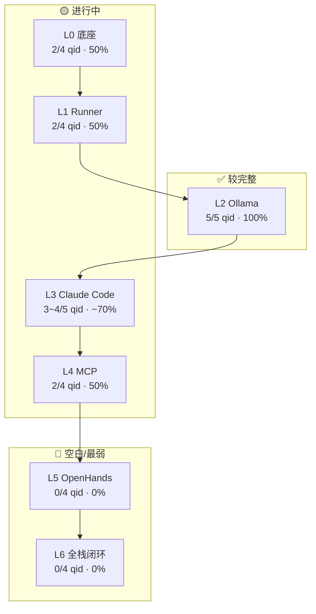

# Cloud Mac 博客 — 内容路线分析与 Stack 完成度（blog2）

> **配套**：[`blog.md`](blog.md)（战略 + 7 天循环）· [`blog-jiexi.md`](blog-jiexi.md)（台账 / qid / SOP）· [`blog1.md`](blog1.md)（Cycle 1 一周执行计划）  
> **快照日期**：2026-06-05  
> **当前进度**：Cycle 1 · Day 3 · Slot B → 下一篇 **L4-Q04**

---

## 一、一句话定位

**不是 Mac 租赁软文站，也不是纯科普或纯测评站。**

对外路线：

> **「Apple Developer Infrastructure / Cloud Mac AI Stack」决策 + 工程实操 + 可复现数据的混合路线**

- 对外自称：**Cloud Mac field notes（现场笔记）**
- 对内定位：**Cloud Mac AI Stack 操作系统说明书** —— 开发者系统入口，不是随机文章列表
- 博客首页语：`Core ML, GitHub Actions runners, Xcode builds, and OpenClaw pipelines — field notes from dedicated macOS and Apple Silicon in production.`
- 主站关系：**主站卖节点，博客卖认知和工作流** —— 读者先理解「为什么需要 Cloud Mac AI Stack」，再考虑租 M4 Mac mini 验证 workload

---

## 二、内容路线：三层混合，不是单一类型

### 2.1 每天 2 篇的固定结构

| 篇次 | 类型 | 作用 | 更像什么 |
|------|------|------|----------|
| **A 篇** | 基础 / 决策文 | 拉新 SEO，回答「要不要 / 为什么」 | **基础分析 + 决策对比** |
| **B 篇** | 系统连接 / 教程 / 实操 | 建立 Stack 模块之间的认知链 | **进阶分析 + 工地 runbook** |

### 2.2 文章角色（type 标签）

| type | 名称 | 典型形态 |
|------|------|----------|
| **A** | 基础决策 | 场景痛点 + 对比 + 决策结论 |
| **B** | 系统连接 | 工作流 + 命令/配置 + 内链 |
| **C** | 对比流量 | vs 本地 Mac、vs Cursor、16GB vs 24GB |
| **D** | 教程实操 | 逐步注册、5 分钟部署、权限配置 |
| **P** | 支柱页 | 端到端流程、Stack 总架构图 |
| **热点** | 趋势插播 | OpenHuman、Anthropic 等，不占 cycle 进度 |

### 2.3 深度档位（depth）

| 档位 | 内容形态 | 何时用 |
|------|---------|--------|
| **R1 首讲** | 决策文、为什么、对比 | 每个 qid 第一轮 |
| **R2 深化** | 教程、命令、配置步骤 | 同一 qid 第二次 |
| **R3 案例** | Flutter 团队 / iOS CI / SaaS 具体故事 | 同一 qid 第三次 |
| **R4 复盘** | 踩坑、故障、数字更新 | 季度回顾 |

### 2.4 与「基础 / 高级 / 工地实测」的对照

| 路线 | 占比（Stack 主线） | 典型文章 |
|------|-------------------|----------|
| **基础分析**（入门科普） | 低，且刻意回避百科 | 早期 iOS/Windows 文略偏这层，但强调边界而非定义 |
| **高级分析**（架构 / 决策） | **高，是骨架** | Runner 执行引擎、Ollama 定位、Agent 时代工作站拆分 |
| **工地实测 / benchmark** | **中高，是差异化武器** | 16GB vs 24GB 一周测试、Swap 调度 runbook、CodeGraph 索引 38 分钟 |
| **教程 / runbook** | 中高，R2 深化方向 | MCP 部署、memory scheduling 脚本、OpenHuman 5 天复现步骤 |
| **对比流量** | 稳定产出 | vs Cursor、vs GPU 云、vs 本地 Mac |
| **趋势 / 热点** | 预留 2 篇/周 | OpenHuman、Anthropic、未来 OpenHands |

**最准确的标签：**

> **「基础设施决策媒体 + 工程现场笔记」**  
> 用实测数字和可抄命令支撑架构判断，不是纯观点，也不是纯 lab report。

系列 Slogan：**Claude Code 生产 Diff，GitHub Runner 生产 Fact。**

### 2.5 写作硬性要求（防 AI 流水文）

每篇至少满足 **2 项**独占信息：

- [ ] 可复现命令 / 配置片段
- [ ] 实测数字（耗时、内存、Swap、shell 调用次数）
- [ ] 明确边界（什么场景 **不** 适用）
- [ ] 与站内已发文章的差异化角度

**禁止：**

- ❌ 不写「Cloud Mac 是什么」百科
- ❌ 禁止「最便宜 Mac 租赁」话术
- ❌ 一篇混讲 Claude Code + Ollama + MCP

**必须：**

- ✅ 写「在什么场景成立 + 为什么 + 对比谁」
- ✅ 结论必须是**决策**，不是总结
- ✅ 每篇至少 3 条站内链（1 支柱向、1 同 cluster、1 跨 cluster）

---

## 三、Stack 完成度总览

### 3.1 各层完成度



| 层级 | 模块 | qid 完成 | 深度覆盖 | 内容形态 | 评级 |
|------|------|----------|----------|----------|------|
| **L0** 底座 | Cloud Mac | 2/4 | R1 为主 | 对比 + 决策 | 🟡 50% |
| **L1** Runner | GitHub Runner | 2/4 | R1 为主 | 架构分析 + OpenClaw | 🟡 50% |
| **L2** Ollama | 私有推理 | **5/5** | R1+R2 齐全 | 实测 + runbook + 对比 | ✅ **最完整** |
| **L3** Claude Code | 编码层 | 3~4/5 | R1 为主 | 对比 + 大仓库 + 工作流 | 🟡 ~70% |
| **L4** MCP | 连接层 | 2/4 | R1+R2 部分 | 概念 + 5min 部署 | 🟡 50% |
| **L5** OpenHands | 自动化 | **0/4** | 无 | 仅 OpenClaw 沾边 | 🔴 **最弱** |
| **L6** 闭环 | 全栈 | **0/4** | 无 | L0-Q02 提前写了部分 | 🔴 **最弱** |
| **X** 交叉 | iOS/OpenHuman | 多篇 | R1 | SEO 流量卫星 | ✅ 充足 |

**Cycle 1 主线进度**：14 篇计划里，严格按 cycle 标记的已发 **3 篇**（L1-Q01、L2-Q01、L2-Q03）；L0-Q02 提前完成。

### 3.2 已发内容形态分布（Stack 主线）

```
决策/架构分析  ████████░░  ~40%  （Runner 执行引擎、Ollama 定位）
对比流量       ██████░░░░  ~30%  （vs 本地 Mac、vs Cursor、16GB vs 24GB）
工地实测       █████░░░░░  ~25%  （一周 Ollama 测试、Swap 数字）
教程/runbook   ████░░░░░░  ~20%  （MCP 5min、内存调度脚本）
支柱页         ░░░░░░░░░░   0%   （L6 尚未启动）
```

**结论**：L2 已把「决策 → 实测 → runbook」三角打全；L1/L4 还缺 R2 教程；L5/L6 几乎空白。

---

## 四、逐层 qid 明细

### L0 — Cloud Mac 底座（50%）

| qid | 核心问题 | 状态 | slug |
|-----|----------|------|------|
| L0-Q01 | 为什么要 Cloud Mac？ | ❌ 空白 | — |
| L0-Q02 | vs 本地 Mac 效率差多少？ | ✅ R1 | `cloud-mac-vs-local-mac-ai-workstation` |
| L0-Q03 | 买还是租？团队采购 | ✅ R1 | `mac-mini-vs-cloud-mac-ios-development-teams` |
| L0-Q04 | 2026 笔记本迁云端 | 📅 6/7 计划 | — |

### L1 — GitHub Runner（50%）

| qid | 状态 | slug | 形态 |
|-----|------|------|------|
| L1-Q01 | ✅ R1 | `github-runner-cloud-mac-execution-engine` | 架构分析 |
| L1-Q02 | 📅 6/8 | Top 10 #5 注册教程 | **教程 D · R2** |
| L1-Q03 | 📅 6/8 | Runner 安全隔离 | **runbook · R2** |
| L1-Q04 | ✅ R1 | `openclaw-cloud-automation` | 自动化对比 |

### L2 — Ollama（100% ✅）

| qid | 状态 | slug | 形态 |
|-----|------|------|------|
| L2-Q01 | ✅ R1 | `ollama-cloud-mac-private-inference-layer` | 决策/定位 |
| L2-Q02 | ✅ R1 | `m4-mac-mini-16gb-vs-24gb-local-ai` | **一周实测** |
| L2-Q03 | ✅ R2 | `ollama-claude-code-parallel-memory-scheduling` | **runbook** |
| L2-Q04 | ✅ R1 | `m4-mac-mini-ai-inference-vs-gpu-cloud` | 成本对比 |
| L2-Q05 | ✅ R1 | `mac-mini-cloud-coreml-inference` | 混合推理 |

### L3 — Claude Code（~70%）

| qid | 状态 | slug | 备注 |
|-----|------|------|------|
| L3-Q01 | ⚠️ 弱覆盖 | 分散在 workstation / 趋势文 | 无独立 qid 文 |
| L3-Q02 | ✅ R1 | `claude-code-vs-cursor-2026` | 对比 |
| L3-Q03 | ✅ R1 | `claude-code-large-repo-codegraph-2026` | 大仓库 |
| L3-Q04 | ⚠️ 嵌入 | 数字在 L0-Q02 里（134 shells） | 缺独立 R2 文 |
| L3-Q05 | ✅ R1 | `claude-code-mac-mini-workstation-2026` | 工作流 |

### L4 — MCP（50%，**当前焦点**）

| qid | 状态 | slug | 形态 |
|-----|------|------|------|
| L4-Q01 | ✅ R1 | `codegraph-ai-coding-agent` | 概念 |
| L4-Q02 | ✅ R2 | `cloud-mac-codegraph-mcp-5-fenzhong` | 5min 教程 |
| **L4-Q03-HUB** | ✅ zh 2026-06-05 | Claude Code MCP Hub（SEO 入口） | **Hub · R2** |
| **L4-Q03-SETUP** | 📅 **6/6 C 加发** | Claude Code MCP Setup 纯教程 | **教程 D · R2** |
| **L4-Q03-ARCH** | 📅 **6/7 C 加发** | MCP Architecture Explained | **架构 A · R2** |
| L4-Q04 | 📅 6/5 B篇 | MCP 权限最小暴露 | **教程 D · R2** |

### L5 — OpenHands（Hub 已立 · 深化排期中）

| qid | 状态 | 计划 |
|-----|------|------|
| L5-Q01 | ✅ Hub | `openhands-cloud-mac-gongju-dao-agent-pingtai` · 架构转折点 · 非 SEO 流量文 |
| L5-Q02 | 📅 6/14 | 第一条自主任务 R2 · **SEO tutorial 落地** |
| L5-Q03 | 📅 6/15 | OpenHands vs OpenClaw |
| L5-Q04 | ❌ | Agent vs DevOps · 可接 L6-Q05 前 |

### L6 — 全栈闭环 + Agent Ops

| qid | 状态 | 计划 |
|-----|------|------|
| L6-Q01 | ❌ | 6/7 A篇 · 端到端流程 **支柱页 P** |
| L6-Q02 | ❌ | 6/9 A篇 · Stack 总架构 **支柱页 P** |
| L6-Q03 | ❌ | git push → green CI 一日流 |
| L6-Q04 | ❌ | 监控告警 |
| **L6-Q05** | 📅 **6/16** | **Agent Ops / Governance** · 系列第⑤枢纽 · AI Engineering Platform |

### X — 交叉流量（充足，非 Stack 主线）

| 系列 | 状态 | 作用 |
|------|------|------|
| **Apple Silicon AI Stack** | ✅ Hub + ②③ 已发（zh） | **内容枢纽**：Framework Page → 实测 SEO → Cloud Mac 转化；见 [`blog1.md`](blog1.md) §六 |
| iOS / Windows / Xcode / Flutter | ✅ 多篇 R1 | SEO 拉新，内链回 Cloud Mac |
| OpenHuman 系列 | ✅ 多篇 | 产品体验实测（5 天 field note） |
| `anthropic-surpass-openai-claude-code-era` | ✅ | 趋势观察，可不绑 qid |

---

## 五、已发文章与 Stack 的两条脉络

### 5.1 Stack 主线（L0–L6）

按 `blog-jiexi.md` §6.2 台账，Stack 相关已发约 **15 篇**（含 X 交叉前的核心层）。

**近期 Cycle 1 已发（带 stack 注释）：**

| 日期 | slug | node | type | qid | depth |
|------|------|------|------|-----|-------|
| 2026-06-04 | `ollama-claude-code-parallel-memory-scheduling` | L2 | B | L2-Q03 | R2 |
| 2026-06-04 | `ollama-cloud-mac-private-inference-layer` | L2 | A | L2-Q01 | R1 |
| 2026-06-03 | `github-runner-cloud-mac-execution-engine` | L1 | B | L1-Q01 | R1 |
| — | `cloud-mac-vs-local-mac-ai-workstation` | L0+L6 | C | L0-Q02 | R1 |

### 5.2 交叉流量卫星（X）

- `can-you-build-ios-apps-on-windows-in-2026` / `without-mac-2026`
- `why-flutter-developers-still-need-macos-for-ios-builds`
- `xcode-on-windows-2026`
- OpenHuman 系列（install、5-day review、vs OpenClaw 等）

**作用**：流量入口，不是 Stack 主线，但正文须内链回 Cloud Mac / Runner / Claude Code。

---

## 六、未来 7 天路线图（Cycle 1 剩余）

> 详见 [`blog1.md`](blog1.md)；下表补充「偏分析还是偏实测」判断。

| 日期 | 篇 | qid | 建议形态 | 偏分析 vs 偏实测 |
|------|----|-----|----------|------------------|
| **6/5** | A | **L4-Q03-HUB** MCP Hub（已发） | Hub + Setup 摘要 + Architecture | **SEO 入口 · 三页分治** |
| 6/5 | B | L4-Q04 MCP 权限 | 权限矩阵 + 配置片段 | **30% 分析 + 70% runbook** |
| 6/6 | A | L5-Q01 OpenHands Hub | 架构转折点 R1 | **Hub · 80% 架构 + SEO H2 补强** |
| **6/14** | A | **L5-Q02** 第一条自主任务 | tutorial R2 | **100% runbook · 吃 OpenHands tutorial 搜索** |
| **6/15** | A | **L5-Q03** vs OpenClaw | 对比 C | **分工澄清** |
| **6/16** | A | **L6-Q05** Agent Ops | 治理 R1 | **企业叙事 · Governance 层** |
| 6/6 | B | 热点位① | 趋势/产品 | 视热点定 |
| **6/6** | **C 加发** | **L4-Q03-SETUP** MCP Setup 纯教程 | copy/paste/verify | **100% runbook** |
| 6/7 | A | L6-Q01 端到端流程 | **支柱页 P** | **70% 架构 + 30% 案例数字** |
| 6/7 | B | L0-Q04 笔记本迁云端 | 决策文 A | **70% 分析对比** |
| **6/7** | **C 加发** | **L4-Q03-ARCH** MCP Architecture Explained | Context→Diff→Fact | **90% 架构理论** |
| 6/8 | A | L1-Q02 Runner 注册教程 | 逐步教程 D | **20% 分析 + 80% 工地实操** |
| 6/8 | B | L1-Q03 Runner 安全隔离 | runbook B | **40% 分析 + 60% 实操** |
| 6/9 | A | L6-Q02 Stack 总架构 | **支柱页 P** | **90% 架构地图** |
| 6/9 | B | 热点或 L5-Q04 | — | — |

---

## 六点五、L4 MCP Cluster 拆分（2026-06-05 起）

| 页 | qid | slug（zh） | 职责 |
|----|-----|------------|------|
| **Hub** | L4-Q03-HUB | `claude-code-mcp-github-wenjian-api-sanliantong` | SEO 入口 · Start here · Topic Cluster · Setup 摘要 |
| **Setup** | L4-Q03-SETUP | `claude-code-mcp-setup-jiaocheng` | 纯 tutorial：copy/paste/expected output · **✅ 6/6 zh** |
| **Arch** | L4-Q03-ARCH | `mcp-architecture-context-diff-fact` | 纯 theory：Context→Diff→Fact · 图解 · **📅 6/7 C 加发** |

**发布顺序**：Hub（✅ 6/5 A）→ **L4-Q04**（6/5 B）→ **SETUP**（**6/6 C 加发**）→ **ARCH**（**6/7 C 加发**）→ 8 语言可后置。  
**6/6、6/7 各 3 篇**：原 A/B 日表不变，仅多写 C 槽。

---

## 七、L4-Q03-HUB 写作指南（已发 · Hub 已瘦身）

**已发**：Claude Code MCP **Hub 入口页**（约 5 分钟 · 导航 + 一图 + 分流；**不含** Step-by-step / 配置 JSON / failure 长文）

**内容归属**：SETUP = 安装教程 · ARCH = 架构深讲 · Hub = 你该去哪

### 7.1 形态判断（Hub 版）

**只做导航 + 概览 + SEO 入口**，不抢 SETUP/ARCH 正文。

| 理由 | 说明 |
|------|------|
| cycle 位置 | Day 3 是「连接层成型」，读者刚读完 L2 实测，现在需要「五层怎么串」 |
| 已有铺垫 | L4-Q02 已做部署教程，L3-Q03 已做大仓库；L4-Q03 任务是**组合** |
| type B 定义 | 系统连接文 = 工作流 + 命令/配置 + 内链，不是 lab report |
| 去重 | 再写 CodeGraph 索引耗时 → 撞 L3-Q03、L0-Q02；再写 134 shells → 撞 L3-Q04 |

### 7.2 推荐结构（比例）

| 块 | 占比 | 内容 |
|----|------|------|
| 痛点场景 | 15% | 「Claude Code 改了代码，但不知道 GitHub issue / 本地 .env / DB schema 在哪」 |
| 三连通架构图 | 25% | GitHub MCP ↔ 本地文件 MCP ↔ API/DB MCP，在 Stack 里 L4 连 L3 |
| 一条完整工作流 | 30% | 从 `codegraph impact` → Claude Code 改 diff → push → Runner 验 fact |
| 可抄配置 | 20% | 3 个 MCP server 的最小配置 + 权限声明 |
| 一个 failure story | 10% | stale index、wrong cwd、只读 vs 可写搞混（`blog.md` 明确要求） |

### 7.3 独占信息 checklist

- ✅ 可复现 MCP 配置片段
- ✅ 一个真实 failure case（不必新 benchmark）
- ⚠️ 数字可选：三连通后 shell 调用次数减少多少（1 组 before/after 即可）

### 7.4 建议内链

- `cloud-mac-codegraph-mcp-5-fenzhong`
- `codegraph-ai-coding-agent`
- `claude-code-large-repo-codegraph-2026`
- `github-runner-cloud-mac-execution-engine`（Diff vs Fact 闭环）
- `ollama-cloud-mac-private-inference-layer`（L2 不抢戏，一笔带过）

### 7.5 6/5 B 篇 L4-Q04（对比）

MCP 权限 = **偏 runbook（70% 实操）**：只读索引 vs 可写工具、最小暴露清单、错误配置示例。

---

## 七点五、Apple Silicon AI Stack · Hub 内容系统（2026-06）

> **定位升级**：`m4-m5-apple-silicon-daiji-shengji-ai-pingtai` 不是普通热点文，而是 **Framework Page / 系列总入口**。

```text
① Hub（决策框架 · Upgrade Score · 三层分区）
        ↓
② 实测（Ollama tok/s · Swap · M4 benchmark）  ← SEO 主入口
        ↓
③ 转化（Cloud Mac vs 等 M5 · 租用决策）     ← 商业闭环
```

| slug（zh） | role | 已完成 |
|------------|------|--------|
| `m4-m5-apple-silicon-daiji-shengji-ai-pingtai` | hub | ✅ 精选 Featured |
| `m4-mac-mini-ollama-shice-7b-14b-tok-swap` | benchmark | ✅ 6/6 热点位① |
| `mac-mini-ai-kaifa-cloud-mac-bi-shengji-m5` | conversion | 📅 **6/9 再写再发**（已撤回，勿提前上线） |

### M4 LLM benchmark 内容集群（SEO 扩展）

```text
M4/M5 AI Stack Hub（总决策 · Upgrade Score）
 ├── Spoke · Ollama benchmark（实测型 · TL;DR + Q→A + Summary Table + FAQ）
 ├── Spoke · Memory / Swap 机制（解释型）
 ├── Spoke · 7B vs 14B 选型（决策型）
 ├── Spoke · Cloud Mac CI benchmark（成本型 · 6/17）
 └── 转化 · Cloud Mac vs 等 M5（6/9）
```

| slug | 角色 | 状态 |
|------|------|------|
| `m4-m5-apple-silicon-daiji-shengji-ai-pingtai` | Hub | ✅ |
| `m4-mac-mini-ollama-shice-7b-14b-tok-swap` | Spoke · **Primary SEO** | ✅ zh · 集群主文；`16gb-vs-24gb`=转化 · `benchmark-spec`=SSOT |
| `ollama-claude-code-bingxing-neicun-paiban` | Spoke · Swap | ✅ |
| `m4-mac-mini-16gb-vs-24gb-bendi-ai` | Spoke · 选型 | ✅ |
| `cloud-mac-ci-ollama-benchmark` | Spoke · CI | 📅 6/17 |
| `m4-ollama-benchmark-spec` | **Spec（canonical）** | 📅 6/20 · tok/s/Swap/环境/脚本统一定义 |

**Spec 之后**：各 Spoke 只引用 Spec + 贴本机数字，不再重复定义术语。

**产品叙事锚点**：Cloud Mac = AI workload **调度节点**（Interaction / Execution / Background 三层）。

**下一步**：6/9 转化篇按日再发 · 6/17 CI benchmark Spoke · 8 语言同步 benchmark 篇。

---

1. **Stack 闭环化**：端到端 workflow 支柱页、Stack 总架构图（L6）
2. **Agent 自动化层**：OpenHands、Runner + Agent 自动修 PR
3. **深化而非重复**：同一模块 R2→R3（Runner 注册教程、MCP 权限、Flutter/iOS 团队案例）
4. **Agent 时代基础设施叙事**：笔记本做 UI，Cloud Mac 做 24/7 执行节点
5. **热点插播**：不占 cycle 进度，蹭 OpenHuman / Claude Code 等趋势
6. **8 语言同步**：同一篇 qid 多语言，SEO 覆盖全球开发者

**Cycle 2 起**：同一 day 的 node 不变，但 depth 最低 R2，或 qid 加 `-flutter` 等案例后缀。

---

## 九、结构性风险与对策

| 风险 | 现状 | 建议 |
|------|------|------|
| **L5/L6 空洞** | OpenHands 0%、闭环 0% | 6/6–6/9 按计划补，热点不推进 `day` |
| **L3-Q01/Q04 悬空** | 「为什么替代 IDE」「134 shells」无独立 qid | Cycle 2 或 blog.md D11 日历补 R2 深化 |
| **旧文缺 stack 注释** | 仅 3 篇新文有 `<!-- stack: ... -->` | 台账是唯一真相；旧文可后补 HTML 注释 |
| **L4-Q01 重复登记** | `codegraph-ai-coding-agent` 与 `ai-coding-agent-code-knowledge-graph` 同 qid | 合并认知，新文注明差异角度 |

---

## 十、全站内容路线对照

| 层面 | 路线 |
|------|------|
| **主站** | Mac mini 云主机商业站：套餐、VNC/SSH、CI/CD、透明定价 |
| **博客** | 开发者基础设施知识库 + SEO 漏斗 |
| **品牌** | Apple Developer Infrastructure，不是「租 Mac 最便宜」 |
| **受众** | iOS/Flutter 开发者、SaaS 团队、CI/CD 工程师、AI 应用团队 |
| **调性** | 技术、基础设施视角、有工程细节 |
| **篇幅** | zh/ja/ko ≥ 1300 字；en/de/fr/ru ≥ 1300 words |

---

## 十一、文档分工（速查）

| 文件 | 职责 |
|------|------|
| [`blog.md`](blog.md) | 战略、Stack 架构、7 天日历、Top 10、Topic Cluster |
| [`blog-jiexi.md`](blog-jiexi.md) | 操作层：qid 问题库、台账、去重规则、cycle 进度、每日 SOP |
| [`blog1.md`](blog1.md) | Cycle 1 一周 14 篇逐日执行表 |
| **本文 `blog2.md`** | 内容路线定性、Stack 完成度地图、形态占比、下一篇写作指南 |
| `.cursor/commands/.blog_history/topic_cursor.json` | 自动化下一 Top 10 编号 |

**一句话工作流：**

> **blog.md 定方向 → blog-jiexi.md 查 qid、填台账 → blog1 看本周排期 → blog2 看完成度与形态 → 标题随便起 → 发完更新进度。**

---

## 十二、行动摘要

1. **L4-Q03-HUB 已发**；**6/5 B** L4-Q04 权限。**6/6 C** SETUP 纯教程 · **6/7 C** ARCH 纯理论（与原 A/B 同日加发）。
2. **6/8 L1-Q02**：下一篇「工地实测 / 逐步教程」重头戏（Top 10 #5 Runner 注册）。
3. **6/7–6/9**：优先补 L6 支柱页，解决 Stack 闭环 0% 问题。
4. **每篇发完**：更新 `blog-jiexi.md` §6.1 + §6.2，HTML 注释写入 4 标签。


